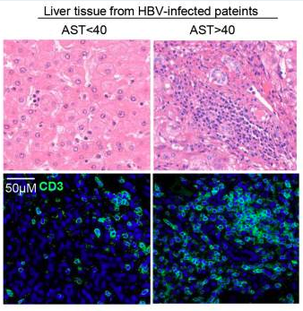

# Background

### Data and Study Objective

In the first assignment, the focus was on analyzing a dataset from the
Gene Expression Omnibus (GEO) with the accession number GSE208637,
originally generated by a study investigating the role of
CD161-expressing CD8+ T cells in chronic Hepatitis B (HBV) infection.
The study aimed to understand the profiles and changes of these cells
during the infection. Utilizing blood and liver tissue samples from
chronic HBV patients, the dataset distinguished between two groups based
on the severity of liver injury indicated by Aspartate Aminotransferase
(AST) levels---AST\>40 representing more severe liver injury and AST\<40
representing less severe injury. Figure 1 shows the difference in tissue
appearance between the 2 conditions and it is derived from the dataset's
orginial paper @liu2023increased. All figures in the Background section
are created using the knitr package (@R-knitr).

```{r, echo=FALSE, warning=FALSE, error=FALSE, out.width = "400px", fig.align='center', fig.cap="Figure 1: Comparison of Liver tissue from HBV infected patients without liver injury (AST<40) and with Liver injury (AST>40)"}
 
```

This differentiation allowed for an analysis of the impact of liver
injury severity on CD161+CD8+ T cells. The dataset, which includes liver
tissues from HBV-infected patients, leverages next-generation sequencing
on the Illumina platform, offering comprehensive gene coverage. With 10
samples, including biological replicates for both conditions, the
dataset provided a robust basis for analysis. Below we can see a table
showcasing the samples in the dataset and the names used for them.

```{r, echo=FALSE, warning=FALSE, error=FALSE, out.width = "70%", fig.align='center', fig.cap="Table 1: Summary of the Dataset Samples, their source and status and the short_name used to represent them" }
knitr::include_graphics("Figures/Samples\ Table.png") 
```

### Filtering & HGNC Mapping

The bioinformatics analysis began by filtering the RNAseq dataset to
enhance the quality of the data for differential expression analysis.
This was achieved by applying an edgeR-based filtering protocol, where
genes with less than 1 read per million in fewer than 4 samples (the
smallest number of replicates in a condition) were filtered out. This
step ensured the removal of low-abundance genes, which can introduce
noise and affect statistical power. This step reduced the number of
genes from 56275 to 16697.

Figure 3 below showcases the Boxplots and Density Plots for the
pre-filtered and post-filtered data. The boxplots show how removal of
low read counts lead to a more uniform distribution of expression levels
across samples and fewer outliers. Similarly the density plots which
show variation in gene expression levels across the samples changed to
become smoother and more consistent in distribution.

```{r, echo=FALSE, warning=FALSE, error=FALSE, out.width = "50%", fig.show='hold', fig.cap="Figure 2: Visualization of data pre and post filtering. Top Left = Pre-filtering Boxplot, Top right = Pre-filtering Density Plot, Bottom Left = Post-filtering boxplot, Bottom Right = Post-filtering Density Plot"}
knitr::include_graphics(c("Figures/Pre-filtering\ boxplot.png", "Figures/Pre-filtering\ density plot.png", "Figures/Post-filtering\ boxplot.png", "Figures/Post-filtering\ density plot.png"))
```

After filtering, gene names were mapped to their respective HGNC
symbols, ensuring that gene identifiers conformed to standard
nomenclature. Out of the original set, 475 non-approved gene symbols
were replaced with HGNC-approved symbols, while 2030 remained unmapped.

## Normalization

Next we Normalized the gene counts using Trimmed Mean of M-values
normalization method. The boxplot and density plot below showcase the
effective standardization of the data due to normalization. An MDS plot
also showed noticeable difference between samples of different
conditions based on their expression profile.

```{r, echo=FALSE, warning=FALSE, error=FALSE, out.width = "50%", fig.show='hold', fig.cap="Figure 3: Visualization of Normalized data. Top Left = Pre-filtering Boxplot, Top right = Pre-filtering Density Plot, Bottom Left = Post-filtering boxplot, Bottom Right = Post-filtering Density Plot"}
knitr::include_graphics(c("Figures/Normalized\ boxplot.png", "Figures/Normalized\ density plot.png", "Figures/MDS\ plot.png"))
```

## Differential Gene Expression

Next we carried out differential gene expression comparing the no Liver
injury condition (L/AST\<40) with the Liver injury condition (H/AST\>40)
using the edgeR protocol that uses Quasi Liklihood fit model. We used a
threshold of 0.000001 for our P-value and our FDR multiple hypothesis
testing. 918 Genes were significant and 534 genes passed correction. We
had 257 upregulated and 277 downregulated genes. Below we can see what
the results of the differential gene expression looks like. We also have
a MA plot showcasing the distribution of all the genes as well as the
Heat Map showcasing the stark difference between the samples from the
two conditions in terms of gene expression profiles.

```{r, echo=FALSE, warning=FALSE, error=FALSE, out.width = "50%", fig.show='hold', fig.cap="Figure 4: Visualization of Differential Gene Expression . Top Left = Differential Gene Expression results, Top Right = MA Plot, Bottom = Heat Map"}
knitr::include_graphics(c("Figures/DGE_reesults.png", "Figures/MA_Plot.png", "Figures/Heat_Map.png"))
```

## Thresholded Over-Representation Analysis

Finally we carried out thresholded ORA analysis using gprofiler on the
full set of significant genes as well as the upregulated and down
regulated genes individually limiting gene set sizes to be between 5 and
800. The below figures showcase the results from the ORA revealing the
most relevant gene sets and their pathways for the 3 separate ORAs
carried out.

```{r, echo=FALSE, warning=FALSE, error=FALSE, out.width = "50%", fig.show='hold', fig.cap="Figure 5: Visualization of Thresholded Over-Representation Analysis. Top Left = All Significant Genes ORA, Top Right = Upregulated Genes ORA, Bottom  = Down Regulated Genes ORA"}
knitr::include_graphics(c("Figures/all_genes_ORA.png", "Figures/upreg_genes_ORA.png", "Figures/downreg_genes_ORA.png"))
```

# Non-thresholded Gene set Enrichment Analysis

For pathway enrichment analysis we will be carrying it out using the
non-thresholded gene set enrichment analysis (GSEA) protocol. The GSEA
software/protocol is particularly suited for RNAseq data and it analyzes
the genes of interest based on a ranking of significance and up/down
regulation. Moreover, we do not need to filter the results of the
differential gene expression before running it through the GSEA. This
allows us to capture information and connections we would have otherwise
not captured through thresholded ORA. All figures in this section are
visualized using the knitr package (@R-knitr).

```{r, echo=FALSE, warning=FALSE, error=FALSE, include=FALSE}
# The accession id for the dataset
geo_accession_id <- "GSE208637"

# get the name of the supplementary file
supplmentary_files = GEOquery::getGEOSuppFiles(geo_accession_id, fetch_files = FALSE)
dataset_file_name <- supplmentary_files$fname

# Download the dataset

# save current directory
working_dir <- file.path(getwd())

# checking to see if the dataset file exists already to download file once and 
# avoid redownloading 
missing_files <- supplmentary_files$fname[!unlist(
  lapply(supplmentary_files$fname, FUN=function(x){
    file.exists( file.path(working_dir, geo_accession_id,x))}))]

# Downlod the file if it has not been downloaded 
if (length(missing_files) > 0){
  # Get the dataset
  supp_file = GEOquery::getGEOSuppFiles(GEO = geo_accession_id, 
                                        filter_regex = missing_files,
                                        baseDir = working_dir,
                                        fetch_files = TRUE)
}

# Create the relative path for the downloaded dataset file
dataset_path <- paste(working_dir,"/GSE208637/GSE208637_readcounts.txt.gz", sep = "")

# read the dataset into a table
liver_disease_data <- read.table(dataset_path, header = TRUE, check.names = TRUE)

# get the list of gene ids which are in the first column of the dataset 
dataset_rownames <- liver_disease_data[,1]

# create a matrix with the count values
dataset_matrix <- as.matrix(liver_disease_data[,2:11])

# set the row names for the matrix as the gene ids
row.names(dataset_matrix) <- dataset_rownames

# our knockdown number
knockdown_number <- 4

# calculate the counts per million for our data matrix
cpms <- edgeR::cpm(dataset_matrix)

# find the rows we want to keep
keep <- rowSums(cpms > 1) >= knockdown_number

# Create new counts datamatrix containing data after filtering
counts <- dataset_matrix[keep,]

# install HGNChelper package if not installed
if (!requireNamespace('HGNChelper', quietly = TRUE)) {
    install.packages('HGNChelper')
}

# get the gene names from the count matrix rownames
filtered_ds_rownames <- row.names(counts)

# Check if the gene names in my dataset are HGNC approved
checked_hgnc_symbols <- HGNChelper::checkGeneSymbols(filtered_ds_rownames)

not_approved_genes <- checked_hgnc_symbols[checked_hgnc_symbols$Approved == FALSE,]

# get only the  non-approved genes with a suggested replacement sumbol
rp_not_approved_genes <- checked_hgnc_symbols[checked_hgnc_symbols$Approved == FALSE &
                                                (!is.na(checked_hgnc_symbols$Suggested.Symbol)),]
# keep only the column with the original symbol and replacement symbol
rp_not_approved_genes <- rp_not_approved_genes[, c(1,3)]


# Loop through each row of 'rp_not_approved_genes'
for(i in 1:nrow(rp_not_approved_genes)) {
  # Get the original gene name and the replacement gene name
  original_gene_name <- rp_not_approved_genes[i, 1]
  replacement_gene_name <- rp_not_approved_genes[i, 2]
  
  # Find the index of the original gene name in the row names of 'counts'
  gene_index <- which(rownames(counts) == original_gene_name)
  
  # Replace the original gene name with the replacement gene name in 'counts'
  if(length(gene_index) > 0) { # Only replace if the original gene name is found
    rownames(counts)[gene_index] <- replacement_gene_name
  }
}

# create edgeR DGElist datatype of our data
edge_list <- edgeR::DGEList(counts = counts, group = colnames(counts))

# calculate the normalization factors
estimated_norm_factors = edgeR::calcNormFactors(edge_list)

# Create Normalized Counts
normalized_counts <- edgeR::cpm(estimated_norm_factors)

# Create DGEList object for dispersion
dispersion_edge_list <- edgeR::DGEList(counts = counts)

# Create groupings from samples 
groups <- factor(c('low_AST', 'low_AST', 'low_AST', 'low_AST', 'high_AST', 'high_AST', 'high_AST', 'high_AST', 'high_AST', 'high_AST'), levels = c("low_AST", "high_AST"))
design <- model.matrix(~groups) 


# Update the DGEList object with the design matrix
dispersion_edge_list$design <- design

# use the edgeR package to estimate dispersion
dispersion_edge_list <- edgeR::estimateDisp(dispersion_edge_list, design)

# Fit data into Quasi Liklihood fit model
fit <- edgeR::glmQLFit(dispersion_edge_list, design)

# Run Differential Gene Expression analyis on the 
qlf.low_vs_high <- edgeR::glmQLFTest(fit, coef='groupshigh_AST')

# Extract differential expression analysis results 
qlf_output_hits <- edgeR::topTags(qlf.low_vs_high, sort.by = "PValue", n = nrow(counts))
```

## Creating Rank File

To carry out Non-thresholded Gene Set Enrichment Analysis, the first
thing we would need to do is generate a .rnk file containing the ranked
set of genes using the genes from assignment 2. Continuing where we left
off in assignment 2. qlf_output_hits contains the results of the
differential gene expression analysis. We will take that and using the
following formula: (-log10(pvalue) \* sign(logFC)), score every gene to
create the .rnk file. Since we are taking the log of the p-value, genes
that were more relevant and significant will receive a higher score,
then since we are multiplying the result by the sign of the log fold
change, down regulated genes will have a negative sign and up regulated
genes will have a positive sign.

```{r, echo=TRUE, warning=FALSE, error=FALSE}

diff_gene_expression_data <- qlf_output_hits[["table"]]

# Adjust P-values of 0 to a small number to avoid log10(0)
diff_gene_expression_data$PValue[diff_gene_expression_data$PValue == 0] <- 1e-30

# Create a Gene name column

diff_gene_expression_data$GeneName <- rownames(diff_gene_expression_data)

# Calculate rank scores using -log10(pvalue) * sign(logFC)
diff_gene_expression_data$rank <- -log10(diff_gene_expression_data$PValue) * sign(diff_gene_expression_data$logFC)

# Create a .rnk file equivalent
# First, order by the rank
ordered_deg_data <- diff_gene_expression_data[order(diff_gene_expression_data$rank, decreasing = TRUE), ]

# Then select only Gene and rank columns
rnk_data <- subset(ordered_deg_data, select=c("GeneName", "rank"))

# set output directory
working_dir <- "data"

# Create output directory if not found
if (!dir.exists(working_dir)) {
    dir.create(working_dir, recursive = TRUE)
}

# path to rnk file
rnk_file <- "data/No_Liver_injury_vs_Liver_injury.rnk"

# Write the data to a .rnk file
write.table(rnk_data, rnk_file, quote=FALSE, sep="\t", row.names=FALSE, col.names=TRUE)
```

## Downloading GMT file

Now that we have created the rank file, the next thing we have to do is
to download the GMT file that contains the gene sets that we will be
using for the analysis. We will be using the the March 1st release of
the Bader Lab gene set @merico2010enrichment. The gene set will contain
all pathways for the Gene Otology Biological Process gene sets and will
not include terms inferred from electronic annotations(IEA). The GMT
file will also not including gene sets from the Pathway Figure OCR
project. Below we will be following the protocol for automatic download
of the GMT file from the Bader Lab GSEA module 5 @merico2010enrichment.
To download the GMT file I used the RCurl package @RCurl

```{r, echo=FALSE, warning=FALSE, error=FALSE}
tryCatch(expr = { library("RCurl")}, 
         error = function(e) {  
           install.packages("RCurl")}, 
         finally = library("RCurl"))

# path for output directory where all the data files and results will be found.  
output_dir <- "generated_data/gsea"

# Create output directory if not found
if (!dir.exists(output_dir)) {
    dir.create(output_dir, recursive = TRUE)
}
# We set the link to the bader gene set that we want 
gmt_url <- "https://download.baderlab.org/EM_Genesets/March_01_2024/Human/symbol/"

filenames <-  RCurl::getURL(gmt_url)
tc <- textConnection(filenames)
contents <- readLines(tc)
close(tc)

# Get the GMT file that has all pathways for the Gene Otology Biological Process gene sets and # does not include terms inferred from electronic annotations(IEA). We are also not including # gene sets from the Pathway Figure OCR project. Get the March 2024 release file
rx <- gregexpr(
    "(?<=<a href=\")(.*.GOBP_AllPathways_noPFOCR_no_GO_iea.*.)(.gmt)(?=\">)",
    contents,
    perl = TRUE
)
gmt_file <- unlist(regmatches(contents, rx))

# Set the destination path for the GMT file
dest_gmt_file <- file.path(output_dir, gmt_file)

# Check if the file exists. If not, download it
if (!file.exists(dest_gmt_file)) {
    download.file(
        paste(gmt_url, gmt_file, sep = ""),
        destfile = dest_gmt_file
    )
}
```

## Carry out GSEA

To carry out GSEA, the first thing we will do is download the GSEA
software command line version in order to be able to run the GSEA from
our R scripts. We will be using GSEA version 4.3.3 @subramanian2005gene.
Below we have the code that we will be using to run the GSEA on our
data. We are using a minimum gene set size of 15 as this ensures that we
avoid potential overinterpretation of results driven by very small gene
sets, which may lack statistical confidence. Subsequently, we restrict
the maximum gene set size to 200 to prevent overly broad interpretations
from excessively large gene sets, which can dilute specific biological
insights.

```{r, echo=FALSE, warning=FALSE, error=FALSE}

# The name to give the analysis in GSEA
analysis_name <- "No_Liver_injury_vs_No_Liver_injury"

# path to GSEA jar file
gsea_jar <- "GSEA_4.3.3/gsea-cli.sh"

run_gsea <- TRUE

# Run GSEA
if(run_gsea){command <- paste(
    gsea_jar,
    "GSEAPreRanked -gmx",
    dest_gmt_file,
    "-rnk",
    rnk_file,
    "-collapse false -nperm 1000 -scoring_scheme weighted",
    "-rpt_label ",
    "No_Liver_injury_vs_No_Liver_injury",
    "  -plot_top_x 20 -rnd_seed 12345  -set_max 200",
    " -set_min 15 -zip_report false ",
    " -out",
    output_dir,
    " > gsea_output.txt",
    sep = " "
)
  system(command)
}
```

## Erichment Results Summary

As for the results of our GSEA analysis, the summary of the results for
the top gene set in the upregulated or Liver Injury/AST \> 40 samples
and the top gene set in the downregulated or No Liver Injury/AST \< 40
samples.

-   **Liver Injury/AST \> 40:**

> > Top Gene Set Returned: CLASSICAL ANTIBODY-MEDIATED COMPLEMENT
> > ACTIVATION%REACTOME DATABASE ID RELEASE 65%173623

> > Gene Set pvalue: 0.0

> > Gene Set ES: 0.8298437

> > Gene Set NES: 2.625203

> > Gene Set FDR: 0.0

> > Genes in Leading Edge: 51 Genes

> > Top Gene Associate with Gene Set: IGKV1-17

-   **No Liver Injury/AST \< 40:**

> > Top Gene Set Returned: ORGANIC ACID CATABOLIC
> > PROCESS%GOBP%<GO:0016054>

> > Gene Set pvalue: 0.0

> > Gene Set ES: -0.7090215

> > Gene Set NES: -2.7072797

> > Gene Set FDR: 0.0

> > Genes in Leading Edge: 97 Genes

> > Top Gene Associate with Gene Set: ALDH6A1

I have added below a figure showcasing the top 10 upregulated gene sets
or gene sets which were most significant in our Liver injury AST \> 40
samples and then a figure showcasing the top 10 down regulated gene sets
or gene sets which were most significant in our No Liver injury AST \<
40 samples. We can see that the Enrichment Score (ES), a measure of the
how overrepresented a gene set in the ranked gene list, the normalized
ES that allows us to compare overrepresentation across gene sets of
different sizes, the P-value which tells us the whether the ES score we
are seeing is significant, and FDR value which correction value that
tells us the confidence in the truth of the result.

```{r, echo=FALSE, warning=FALSE, error=FALSE, out.width = "50%", fig.show='hold', fig.cap="Table 2: GSEA results for Top 10 gene sets enriched in Liver Injury/AST > 40 samples "}
knitr::include_graphics(c("Figures/GSEA_up_results.png"))
```

```{r, echo=FALSE, warning=FALSE, error=FALSE, out.width = "50%", fig.show='hold', fig.cap="Table 3: GSEA results for Top 10 gene sets enriched in No Liver Injury/AST < 40 samples "}
knitr::include_graphics(c("Figures/GSEA_down_results.png"))
```

## Assignment 2 Result Comparison

Comparing the results of this assignment to assignment 2 qualitatively,
can be done. TO carry this out I looked at only the top 10 enriched gene
sets in the upregulated or Liver injury samples between assignment 2 and
3 as well as the top 10 enriched gene sets in the down regulated or No
Liver injury samples between assignment 2 and 3. What we can clearly see
is that there is significant overlap between the two with most of the
same gene sets highlighted in both. Moreover, the main theme of the gene
sets in the two assignments are the same, for example immune system and
immune response related gene sets are the most upregulated in assignment
2 and enriched in the Liver injury samples in assignment 3

# GSEA Cystoscape Visualization

The Next thing we set out to do is to visualize the Enrichment Analysis
using an Enrichment Map. To carry this out we used the
@shannon2003cytoscape software. We use cytoscape because it is
particularly good at creating enrichment maps as it can integrate
various types of attribute data (like gene expression profiles and
phenotypic signatures) and visualize the interconnectedness and
relationships between large sets of genes, highlighting enriched
pathways and clusters within biological networks. All figures in this
section are visualized using the knitr package (@R-knitr).

### 1. Create an enrichment map - how many nodes and how many edges in the resulting map? What thresholds were used to create this map?

For my Base enrichment map before annotation, I used an FDR threshold of
0.000001, as the number of genes was very large and so we wanted only
the most relevant and significant genes and pathways to be highlighted.
There were 94 nodes and 456 edges. There are various evident clusters
for both the upregulated and down regulated gene set pathways.

```{r, echo=FALSE, warning=FALSE, error=FALSE, out.width = "50%", fig.show='hold', fig.cap="Figure 6: Base Enrichment Map without annotations"}
knitr::include_graphics(c("Figures/Enrichment_Map.png"))
```

### 2. Annotate your network - what parameters did you use to annotate the network. If you are using the default parameters make sure to list them as well.

To annotate the network I used the GSEA AutoAnnotate App in cytoscape
@kucera2016autoannotate. The parameters used were as follows:

-   Cluster Source: clusterMaker2
-   ClusterMaker Algorithm: MCL Cluster
-   Edge Attribute: EnrichmentMap::similarity_coefficient
-   Label Maker: WordCloud: Adjacent Words (default)
-   Max Words Per Label: 3
-   Minimum word occurrence: 1
-   Word Adjacency Bonus: 8
-   Normalization Factor: 0.5
-   Attribute Names: [EnrichmentMap::GS_DESCR]
-   Display Style: Clustered-Standard
-   Max Words per Cloud: 250
-   Cluster Cutoff: 1.0
-   Min Word Occurrence: 1

Below we can see annotated enrichment Map. We can see that 10 clusters
were highlighted. The largest cluster contained 27 upregulated gene sets
related to the mediated mapk activation pathways. The second largest
cluster contained 14 down regulated gene sets related to the amino acid
catabolic pathways. The rest of the clusters and their pathways can be
seen as well. Moreover this is a publication ready figure

```{r, echo=FALSE, warning=FALSE, error=FALSE, out.width = "50%", fig.show='hold', fig.cap="Figure 7: GSEA Enrichment Map after AutoAnnotation and Labelling. Also a publication grade figure "}
knitr::include_graphics(c("Figures/Annotated_Enrichment_Map.svg"))
```

### 3. Make a publication ready figure - include this figure with proper legends in your notebook.

The annotated figure created in part 2 is publication ready, as in it is
in the svg format and it also has a proper legend and title.

### 4. Collapse your network to a theme network. What are the major themes present in this analysis? Do they fit with the model? Are there any novel pathways or themes?

Below we can see the collapsed Network. To Collapse the Network we used
the Summary Netowork feature of Cytoscape. We can see that the cluster
pathways are the same ones seen in the previous figure The largest
cluster is a cluster of Liver injury gene sets called mediated mapk
activation, while the second largest cluster was a cluster of No Liver
injury gene sets that has to do with the amino acid catabolic pathways.
I would expect that the major themes for the Liver injury gene sets
would be immune response and immune modulation related which was the
overall case when we looked at the gene sets/pathways indivudally.
However, the label the auto annotation gave the largest cluster was the
MAPK pathways which is a very general pathway involved in regulating
cell proliferation, differentiation, motility, and survival
@cargnello2011activation. We can see that collapsing did not add any
novel pathways or themes from the previous figure.

```{r, echo=FALSE, warning=FALSE, error=FALSE, out.width = "50%", fig.show='hold', fig.cap="Figure 8: GSEA Enrichment Map after AutoAnnotation and Labelling. Also a publication grade figure "}
knitr::include_graphics(c("Figures/Theme-Annotate - Summary Network.svg"))
```

# Interpretation

1.  Do the enrichment results support conclusions or mechanism discussed
    in the original paper? How do these results differ from the results
    you got from Assignment #2 thresholded methods

Similar to what was discussed in assignment 2 the pathways that were
upregulated or most relevant in the Liver injury/AST \> 40 were those
that have to do with immune response. Moreover, the results do support
the conclusions that the authors of the original paper reached. They
mainly focused on the upregulation of immune response related genes such
as interlukin genes IL1β and IL8 which play roles in chemotaxis and
activation of neutrophils @liu2023increased. Moreover, in the largest
cluster in the annotated enrichment map one of the pathways in that
cluster has to do with IL10 synthesis, so Interlukin mediated immune
response similar to what was reported in the study.

What was interesting and different about the results in the enrichment
analysis is that it provided very specific pathways and provided a large
number of relevant gene sets, even at the stringent threshold that we
used of 0.000001. So, although the major themes were the same, the
results of the thresholded ORA analysis were very broad and
non-specific.

2.  Can you find evidence, i.e. publications, to support some of the
    results that you see. How does this evidence support your result?

In terms of supporting my results, a paper by @miyazoe2002influence.
that looked at the hepatitis B Virus carriers found that the
Interlukin-10 or IL10 was associated with disease progression in
patients with this Liver disease. This supports our results because as I
mentioned in the previous section, the pathway associated with IL10
synthesis was upregulated in the Liver injury patient sample.

3.  Investigated Pathway of Interest

Since the original study focuses a great deal on the role of cytokines
in liver injury, specifically interlukins IL1β and IL8. I was interested
on an upregulated pathway in the largest cluster of the data called
FCGR3A-MEDIATED IL10 SYNTHESIS Pathway. Since IL10 is another
interlukin. Below you can view the gene network of this pathway created
using GeneMANIA in cytoscape. Figure visualized using the knitr package
(@R-knitr).

```{r, echo=FALSE, warning=FALSE, error=FALSE, out.width = "50%", fig.show='hold', fig.cap="Figure 9: Gene Network of the pathway of interst, the FCGR3A-MEDIATED IL10 SYNTHESIS Pathway"}
knitr::include_graphics(c("Figures/Pathway_of_Interest.svg"))
```

# Answers To Assignment Questions

**Non-thresholded Gene set Enrichment Analysis:**

1.  What method did you use? What genesets did you use? Make sure to
    specify versions and cite your methods.

    [Carry out GSEA]

2.  Summarize your enrichment results.

    [Erichment Results Summary]

3.  How do these results compare to the results from the thresholded
    analysis in Assignment #2. Compare qualitatively. Is this a straight
    forward comparison? Why or why not?

    [Assignment 2 Result Comparison]

**Visualize your Gene set Enrichment Analysis in Cytoscape:**

1.  Create an enrichment map - how many nodes and how many edges in the
    resulting map? What thresholds were used to create this map? Make
    sure to record all thresholds. Include a screenshot of your network
    prior to manual layout.

    [1. Create an enrichment map - how many nodes and how many edges in
    the resulting map? What thresholds were used to create this map?]

2.  Annotate your network - what parameters did you use to annotate the
    network. If you are using the default parameters make sure to list
    them as well.

    [2. Annotate your network - what parameters did you use to annotate
    the network. If you are using the default parameters make sure to
    list them as well.]

3.  Make a publication ready figure - include this figure with proper
    legends in your notebook.

    [3. Make a publication ready figure - include this figure with
    proper legends in your notebook.]

4.  Collapse your network to a theme network. What are the major themes
    present in this analysis? Do they fit with the model? Are there any
    novel pathways or themes?

    [4. Collapse your network to a theme network. What are the major
    themes present in this analysis? Do they fit with the model? Are
    there any novel pathways or themes?]

**Interpretation**

[Interpretation]

# References
